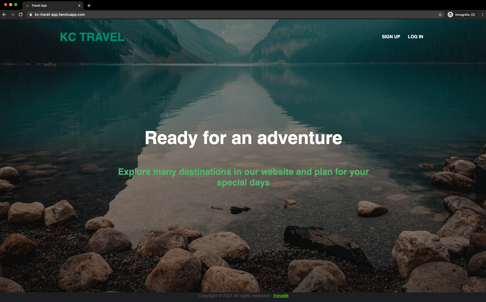

# Travel app (Ruby on Rails Application)

A travel app made with Ruby, Rails, Bootstrap, HTML, CSS, and SQLite

## TOOL

1. Ruby
2. Rails
3. Active Record
4. SQLite
5. Bootstrap
6. Bcrypt
7. HTML
8. CSS
  

## INTRUCTIONS

1. Clone this repository
2. Using the terminal navigate to the root directory
3. Run "Bundle Install"
4. Run "rails server"

## FEATURES

* Users can sign up or login (with security using Bcrypt) to the application.
* Users can search the destinations by Rating, by Popular, by City and by State
* Users can mark destinations as their favorites.
* Users can create their own itinerary and can add events of a specific destination. Each itinerary is a planner for their special days.
* Users can keep track of their itineraries and can mark one as an archived itinerary after they visited.
* Users can post reviews and ratings for destination and it will update the database.
* Users can contribute to our application by updating new destinations and events.

## PREVIEW

----->    https://kc-travel-app.herokuapp.com/

### Built by Chi Nguyen and Kirsty Brewster
